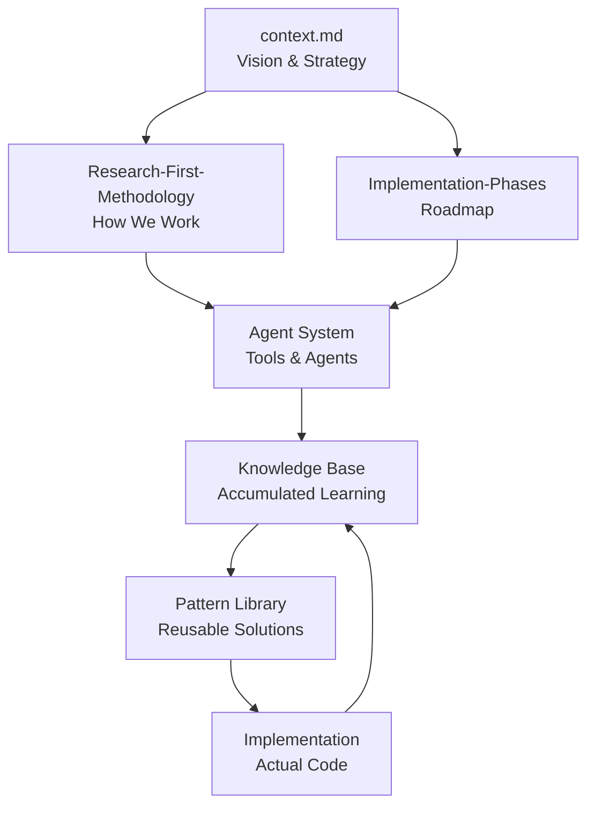
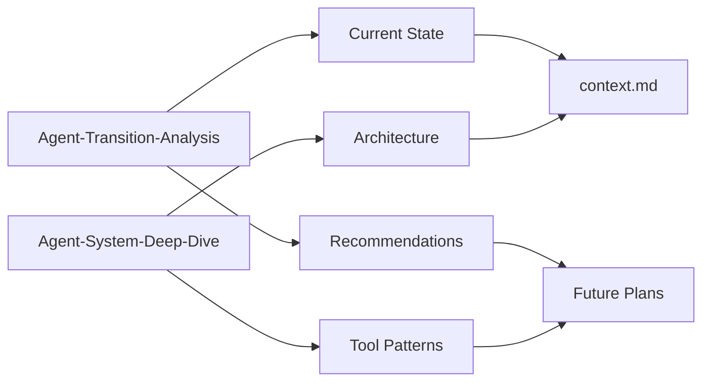

# Knowledge Map: Navigation Guide

## 🗺️ Quick Navigation

### Core Documents
- 🎯 [[context|Vision & Context]] - High-level vision and strategy
- 🔬 [[Research-First-Methodology]] - Core development methodology
- 📈 [[Implementation-Phases]] - Phased roadmap

### Research & Analysis
- 🔍 [[Agent-Transition-Analysis-2024-01-16]] - Agent system analysis
- 🧠 [[Agent-System-Deep-Dive-2024-01-16]] - Detailed agent exploration

## 📂 Directory Structure

```
_knowledge/
├── 00-Index/              # Navigation and maps
│   ├── Knowledge-Map.md   # This file
│   └── MOCs/             # Maps of Content
│
├── 01-Research/          # Research findings
│   ├── Agent-Transition-Analysis-2024-01-16.md
│   └── Agent-System-Deep-Dive-2024-01-16.md
│
├── 02-Architecture/      # Architectural documents
│   ├── Research-First-Methodology.md
│   └── Implementation-Phases.md
│
├── 03-Components/        # Component documentation
├── 04-Decisions/         # ADRs and decisions
├── 05-Dependencies/      # Dependency analysis
├── 06-Performance/       # Performance research
├── 07-Security/          # Security considerations
├── 08-Tech-Debt/         # Technical debt tracking
└── 09-Daily/            # Daily notes
```

## 🔗 Document Relationships

### Vision to Implementation Flow


### Agent System Documentation


## 📊 Knowledge Categories

### By Purpose
| Category | Documents | Purpose |
|----------|-----------|---------|
| **Vision** | context.md | Strategic direction |
| **Methodology** | Research-First-Methodology | How we work |
| **Planning** | Implementation-Phases | Roadmap and phases |
| **Analysis** | Agent-Transition-Analysis | Current state assessment |
| **Architecture** | Agent-System-Deep-Dive | System design |

### By Phase
| Phase | Focus | Key Documents |
|-------|-------|---------------|
| **Phase 1** | Infrastructure | Agent analyses, context.md |
| **Phase 2** | Knowledge Building | Research methodology, patterns |
| **Phase 3** | Implementation | Component docs, ADRs |
| **Phase 4** | Optimization | Performance, metrics |

## 🎯 Quick Access by Need

### "I want to understand..."
- **The vision** → [[context|Vision & Context]]
- **How we work** → [[Research-First-Methodology]]
- **The roadmap** → [[Implementation-Phases]]
- **Current agents** → [[Agent-Transition-Analysis-2024-01-16]]

### "I need to..."
- **Research a topic** → Use researcher agents, document in `01-Research/`
- **Make a decision** → Follow ADR process in `04-Decisions/`
- **Find a pattern** → Check Pattern Library (coming soon)
- **Track progress** → Review [[Implementation-Phases]]

## 📈 Knowledge Growth Tracking

### Current Stats
```yaml
Total Documents: 7
Research Articles: 2
Architecture Docs: 2
Context Documents: 2
Index Documents: 1
Cross-references: 15+
```

### Growth Targets (Phase 2)
```yaml
Target Documents: 50+
Pattern Library: 30+ patterns
ADRs: 10+
Best Practices: 20+
Cross-references: 200+
```

## 🔄 Document Update Schedule

| Document | Update Frequency | Last Updated | Next Review |
|----------|-----------------|--------------|-------------|
| context.md | Weekly | 2025-01-16 | 2025-01-23 |
| Knowledge-Map | Weekly | 2025-01-16 | 2025-01-23 |
| Research-First-Methodology | Monthly | 2025-01-16 | 2025-02-16 |
| Implementation-Phases | Phase endings | 2025-01-16 | Phase 2 end |
| Agent analyses | As needed | 2025-01-16 | On changes |

## 🏷️ Tag System

### Type Tags
- `#type/research` - Research findings
- `#type/architecture` - Architectural documents
- `#type/methodology` - Process and methods
- `#type/index` - Navigation and maps
- `#type/decision` - ADRs and decisions

### Topic Tags
- `#topic/agents` - Agent system
- `#topic/patterns` - Design patterns
- `#topic/frameworks` - Framework-specific
- `#topic/performance` - Performance related
- `#topic/security` - Security considerations

### Status Tags
- `#status/current` - Active and current
- `#status/draft` - Work in progress
- `#status/review` - Needs review
- `#status/archived` - Historical reference

## 🚀 Next Steps

### Immediate (This Week)
1. Create Pattern Library structure
2. Document first 5 patterns
3. Create ADR template
4. Begin framework research

### Short-term (This Month)
1. Complete Phase 2 foundation
2. Document 20+ patterns
3. Create decision trees
4. Build quick reference guides

### Long-term (This Quarter)
1. Complete Phase 2
2. Begin Phase 3 implementation
3. Measure improvements
4. Scale knowledge system

## 🔗 External Links

### Parent Documents
- [~/.claude/](..) - Agent system root
- [~/obsidian-vault/](~/obsidian-vault/) - Global knowledge

### Related Systems
- Agent definitions in `../agents/`
- Templates in `../`
- Scripts in `../`

---

*Map Version: 1.0*  
*Created: 2025-01-16*  
*Next Update: 2025-01-23*  
*Maintained by: Knowledge Curator*