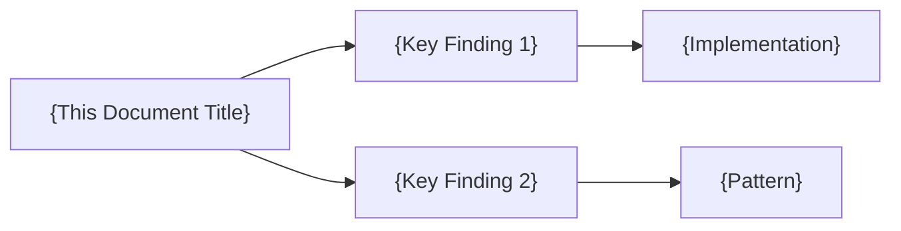

# {Title}: {Specific Research Focus}

*Generated: {Date} at {Time} by {agent-name}*

## 🎯 Research Objective

**Primary Question**: {What specific question is this research answering?}

**Scope**: {What is included and explicitly excluded from this research?}

**Success Criteria**: {How will we know this research is complete?}

## 📋 Executive Summary

{One paragraph (3-5 sentences) summary of the most important findings. This should be useful even if the reader doesn't read the rest of the document.}
^summary

## 🔍 Key Findings

### Finding 1: {Clear, Actionable Title}

**Problem Statement**: {What specific problem does this address?}

**Solution**: {Concrete solution with implementation details}

**Evidence/Example**:
```{language}
// Concrete code example or configuration
{code}
```

**Impact**: 
- Performance: {impact on performance}
- Developer Experience: {impact on DX}
- Maintenance: {impact on maintainability}

**Trade-offs**: {What are we giving up to get this benefit?}

### Finding 2: {Title}

{Follow same structure as Finding 1}

### Finding 3: {Title}

{Follow same structure as Finding 1}

## 📊 Data & Evidence

### Metrics Collected
| Metric | Value | Context |
|--------|-------|---------|
| {metric_name} | {value} | {why this matters} |

### Benchmarks/Comparisons
{Comparative analysis with alternatives, before/after scenarios, or industry standards}

### Sources Consulted
1. **Official Documentation**: [{Source Name}]({URL}) - {Key insight gained}
2. **Community Resources**: [{Source Name}]({URL}) - {Key insight gained}
3. **Code Analysis**: {Files/patterns analyzed} - {Key insight gained}

## 💡 Recommendations

### Immediate Actions (Do Now)
1. **{Action}**: {Specific, actionable step with clear outcome}
   - Effort: {Low|Medium|High}
   - Impact: {Low|Medium|High}
   - Risk: {Low|Medium|High}

### Short-term Improvements (This Sprint)
1. **{Improvement}**: {What and why}

### Long-term Considerations (Future)
1. **{Consideration}**: {Strategic direction or architectural change}

## 🔗 Related Research

### Prerequisites (Read First)
- [[{Document that provides necessary context}]]

### Related Topics (See Also)  
- [[{Related research document}]]: {How it relates}
- [[{Another related document}]]: {How it relates}

### Follow-up Research Needed
- [ ] {Question that remains unanswered}
- [ ] {Area that needs deeper investigation}

## 📝 Change Log

### {Date} {Time} - v{version}
- **Summary**: {One-line description of changes}
- **Changes Made**:
  - {Specific change 1}
  - {Specific change 2}
- **Sections Updated**: [{Section names}]
- **New Findings**: {Count}
- **Time Invested**: {minutes} minutes

## 🏷️ Metadata

### Research Quality Indicators
- **Depth**: ⬜ Surface | ⬜ Moderate | ⬜ Deep | ⬜ Comprehensive
- **Confidence**: ⬜ Low | ⬜ Medium | ⬜ High | ⬜ Verified
- **Completeness**: {percentage}% - {what remains to research}

### Research Statistics  
- **Total Time Invested**: {cumulative_minutes} minutes
- **Sources Consulted**: {count}
- **Code Examples**: {count}
- **Findings**: {count}
- **Recommendations**: {count}
- **Revisions**: {revision_count}

### Knowledge Graph Connections


## 🚦 Status & Next Steps

**Current Status**: ⬜ Draft | ⬜ Under Review | ⬜ Approved | ⬜ Implemented

**Validation**: ⬜ Unvalidated | ⬜ Partially Tested | ⬜ Fully Validated

**Next Steps**:
1. {Immediate next action}
2. {Follow-up required}

---
*Note: This research is part of the continuous knowledge building process. It may be updated as new information becomes available or as implementation reveals additional insights.*