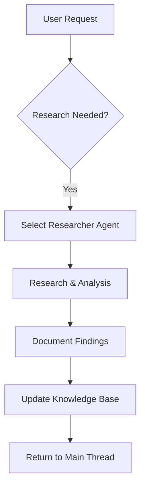
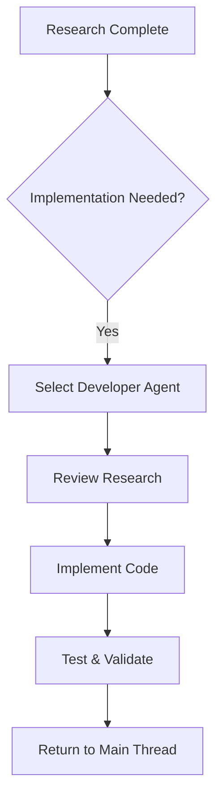
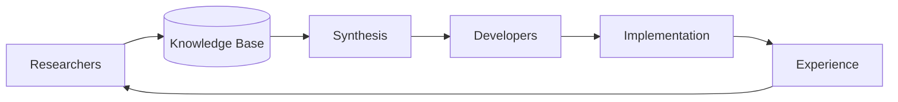

# Agent System Deep Dive: Architecture & Transition Analysis 2024-01-16

## 🎯 Executive Summary
Comprehensive analysis of 27 Claude agents reveals a sophisticated dual-phase system transitioning from code-modification to research-focused architecture. The system demonstrates clear separation of concerns with 10 pure researchers, 15 code-modifying developers, and 2 specialized roles. The transition represents a paradigm shift from "code-first" to "knowledge-first" development methodology.
^summary

## 📊 Agent Inventory & Categorization

### Total Agent Count: 27 Active Agents

| **Category** | **Count** | **Percentage** | **Tool Pattern** |
|-------------|-----------|----------------|------------------|
| **Pure Researchers** | 10 | 37% | Read, Write, Grep, Glob, WebFetch |
| **Code Developers** | 15 | 56% | Read, Edit, MultiEdit, Grep, Glob, Bash |
| **Code Reviewers** | 1 | 4% | Read, Grep, Glob, Bash |
| **Knowledge Curators** | 1 | 4% | Read, Write, Grep, Glob |

## 🔬 Tool Permission Analysis

### Tool Distribution Patterns
```
🔍 READ ACCESS (Universal)
├── All 27 agents have Read capability
├── Foundation for all agent operations
└── Enables codebase analysis and research

📝 WRITE ACCESS (Researchers Only)
├── 10 research agents use Write for documentation
├── NO code agents have Write permissions
└── Clear separation: Write = Documentation, Edit = Code

🛠️ EDIT/MULTIEDIT (Developers Only)
├── 15 agents retain code modification abilities
├── Used for actual implementation work
└── Represents "execution" phase agents

🌐 WEBFETCH (Research-Heavy)
├── 20 agents have WebFetch capability
├── Critical for documentation research
└── Enables external knowledge gathering

⚡ BASH (Execution-Heavy)
├── 11 agents have Bash access
├── Primarily developers + reviewer
└── Used for running tools, tests, builds
```

## 🏗️ Architecture Patterns

### Research Agents (Knowledge Gatherers)
**Purpose**: Gather, analyze, and document knowledge for future reference
**Tool Pattern**: `Read, Write, Grep, Glob, WebFetch`

#### Framework Researchers
1. **react-researcher** - React patterns, hooks, best practices
2. **svelte-researcher** - Svelte/SvelteKit patterns, runes system
3. **nextjs-researcher** - Next.js features, App Router, SSR/SSG patterns

#### Domain Researchers  
4. **ui-ux-researcher** - UI patterns, accessibility, user experience
5. **styling-researcher** - CSS architectures, Tailwind, CSS-in-JS
6. **data-flow-researcher** - State management, API patterns
7. **component-library-researcher** - shadcn/ui, Storybook, headless libraries
8. **tailwind-researcher** - Tailwind optimization, configuration
9. **design-system-researcher** - Design tokens, systematic design

#### Meta Researcher
10. **knowledge-curator** - Organizes research, maintains knowledge graphs

### Developer Agents (Code Modifiers)
**Purpose**: Execute implementation based on research findings
**Tool Pattern**: `Read, Edit, MultiEdit, Grep, Glob, Bash, [WebFetch]`

#### Framework Developers (Overlapping with Researchers)
1. **react-developer** - React component implementation
2. **svelte-developer** - Svelte component implementation  
3. **nextjs-developer** - Next.js application development

#### Execution Specialists
4. **testing-qa** - Test implementation and quality assurance
5. **performance-optimizer** - Code optimization and performance tuning
6. **deployment-cicd** - CI/CD configuration and deployment
7. **debug-troubleshooter** - Bug fixing and troubleshooting
8. **refactor-specialist** - Code refactoring and cleanup

#### Domain Specialists  
9. **styling-specialist** - CSS/Tailwind implementation
10. **design-theming-specialist** - Theme and design system implementation
11. **data-flow-architect** - Data flow and state management implementation
12. **state-persistence-sync** - Persistence and sync implementation
13. **ui-ux-accessibility** - UI implementation with accessibility
14. **firebase-specialist** - Firebase integration
15. **api-integration** - API integration implementation
16. **ios-optimizer** - iOS-specific optimizations

### Specialized Roles
**code-reviewer** - `Read, Grep, Glob, Bash` - Quality analysis without modification

## 🔄 Information Flow Architecture

### Phase 1: Knowledge Gathering


### Phase 2: Implementation


### Knowledge Integration Loop


## 📈 Transition Analysis: From Code-First to Knowledge-First

### Historical Pattern (Pre-Transition)
- Agents directly modified code based on requests
- Limited knowledge retention between sessions
- Duplicate research across similar requests
- Reactive problem-solving approach

### Current Pattern (Mid-Transition)
- **37% agents** converted to research-only
- **56% agents** retain code modification
- **Parallel systems** exist (researcher + developer for same domain)
- Knowledge base grows continuously

### Target Pattern (Post-Transition)
- **Research-first methodology**: Gather knowledge before implementation
- **Persistent knowledge**: Research available across all sessions
- **Informed development**: Developers reference research findings
- **Continuous learning**: System becomes smarter over time

## 🎯 Duplicate Agent Analysis

### Framework Overlaps (Priority: Remove Duplicates)
| Domain | Researcher | Developer | Status | Action |
|--------|------------|-----------|---------|---------|
| React | ✅ react-researcher | ⚠️ react-developer | Duplicate | Remove developer |
| Svelte | ✅ svelte-researcher | ⚠️ svelte-developer | Duplicate | Remove developer |
| Next.js | ✅ nextjs-researcher | ⚠️ nextjs-developer | Duplicate | Remove developer |

### Domain Overlaps (Consider Merger)
| Domain | Researcher | Developer | Status | Action |
|--------|------------|-----------|---------|---------|
| Styling | ✅ styling-researcher | ⚠️ styling-specialist | Converted | Archive specialist |
| UI/UX | ✅ ui-ux-researcher | ⚠️ ui-ux-accessibility | Converted | Archive specialist |
| Data Flow | ✅ data-flow-researcher | ⚠️ data-flow-architect | Converted | Archive architect |
| Design | ✅ design-system-researcher | ⚠️ design-theming-specialist | Converted | Archive specialist |

## 💡 Key Insights

### Successful Transition Patterns
1. **Clear Naming Convention**: `-researcher` suffix indicates research-only agents
2. **Tool Restriction Strategy**: Removing Edit/MultiEdit forces research focus
3. **Write Tool Repurposing**: Write now means documentation, not code
4. **WebFetch Critical**: Enables external documentation research
5. **Knowledge Persistence**: Research survives across sessions

### Challenges Identified
1. **Duplicate Agents**: Framework domains have both researcher and developer versions
2. **Inconsistent Conversion**: Some domains fully converted, others partially
3. **Tool Pattern Confusion**: Same tools used differently by different agent types
4. **Specialization Needed**: Some agents must remain code-modifying (testing, deployment)

### Architectural Strengths
1. **Clear Separation**: No hybrid agents with both Edit and Write permissions
2. **Scalable Design**: Can add researchers without affecting developers
3. **Knowledge Accumulation**: System gets smarter over time
4. **Flexible Execution**: Can choose research-only or research + implementation

## 🚀 Recommendations

### Immediate Actions (Priority 1)
1. **Remove Framework Duplicates**
   - [ ] Archive `react-developer` (use react-researcher)
   - [ ] Archive `svelte-developer` (use svelte-researcher)  
   - [ ] Archive `nextjs-developer` (use nextjs-researcher)

2. **Archive Converted Specialists**
   - [ ] Archive `styling-specialist` (use styling-researcher)
   - [ ] Archive `ui-ux-accessibility` (use ui-ux-researcher)
   - [ ] Archive `data-flow-architect` (use data-flow-researcher)
   - [ ] Archive `design-theming-specialist` (use design-system-researcher)

### Strategic Decisions (Priority 2)
3. **Keep as Code-Modifying Agents** (Purposeful)
   - ✅ **testing-qa** - Must write/modify tests
   - ✅ **deployment-cicd** - Must modify CI/CD configurations
   - ✅ **debug-troubleshooter** - Must fix bugs in code
   - ✅ **refactor-specialist** - Must refactor existing code
   - ✅ **performance-optimizer** - Must optimize code performance

4. **Evaluate for Conversion** (Case-by-case)
   - ❓ **state-persistence-sync** → Research persistence patterns?
   - ❓ **firebase-specialist** → Research Firebase integration patterns?
   - ❓ **api-integration** → Research API design patterns?
   - ❓ **ios-optimizer** → Research iOS optimization strategies?

### Future Architecture (Priority 3)
5. **Agent Selection Intelligence**
   - Create meta-agent for choosing appropriate researcher vs developer
   - Implement workflow: Research first, then develop if needed
   - Add metrics tracking for agent usage patterns

6. **Knowledge Synthesis**
   - Create cross-domain knowledge synthesis agent
   - Implement automatic knowledge graph generation
   - Add research gap identification and prioritization

## 📊 Transition Metrics

### Current State Assessment
```
🎯 TRANSITION PROGRESS: 60% Complete

✅ Successfully Converted: 37%
   - 10 pure researcher agents
   - Clear tool separation achieved
   - Knowledge base actively growing

⚠️ Duplicate Removal Needed: 15%
   - 4 domain overlaps requiring cleanup
   - Framework duplicates causing confusion

🔧 Purposeful Code Agents: 20%
   - 5 agents that should remain code-modifying
   - Clear execution-focused roles

❓ Evaluation Needed: 15%
   - 4 agents requiring case-by-case decision
   - Potential for further research conversion

🚀 Architecture Complete: 13%
   - 3 agents in specialized roles
   - 1 reviewer, 1 curator, 1 optimizer
```

### Target State Vision
```
📈 DESIRED DISTRIBUTION

🔬 Researchers (60%): ~16 agents
   - Framework researchers: 3
   - Domain researchers: 10  
   - Specialized researchers: 3

⚡ Developers (30%): ~8 agents
   - Execution specialists: 5
   - Implementation specialists: 3

🎯 Meta Agents (10%): ~3 agents
   - Code reviewer: 1
   - Knowledge curator: 1
   - Agent selector: 1 (new)
```

## 🌊 Information Flow Patterns

### Current Flow: Dual-Track System
```
USER REQUEST
    ↓
MAIN CLAUDE THREAD
    ↓
┌─────────────────┬─────────────────┐
│   RESEARCH      │   DEVELOPMENT   │
│   TRACK         │   TRACK         │
├─────────────────┼─────────────────┤
│ Choose          │ Choose          │
│ Researcher      │ Developer       │
│ Agent           │ Agent           │
│     ↓           │     ↓           │
│ Gather          │ Modify          │
│ Knowledge       │ Code            │
│     ↓           │     ↓           │
│ Document        │ Test &          │
│ Findings        │ Validate        │
└─────────────────┴─────────────────┘
    ↓
SYNTHESIZED RESPONSE
    ↓
USER
```

### Future Flow: Knowledge-First System
```
USER REQUEST
    ↓
AGENT SELECTOR (Meta-Agent)
    ↓
┌─────────────┐
│ RESEARCH    │ ← Always First
│ PHASE       │
└─────────────┘
    ↓
KNOWLEDGE BASE UPDATE
    ↓
┌─────────────────────┐
│ IMPLEMENTATION      │ ← Optional
│ PHASE               │
│ (Based on Research) │
└─────────────────────┘
    ↓
MAIN CLAUDE SYNTHESIS
    ↓
USER
```

## 🔮 Future Architecture Vision

### Knowledge-First Development Cycle
1. **Request Analysis**: Determine research vs implementation needs
2. **Knowledge Gathering**: Researchers investigate and document
3. **Knowledge Synthesis**: Curator organizes and connects findings  
4. **Implementation Planning**: Developers reference research
5. **Execution**: Code modification based on informed decisions
6. **Experience Capture**: Results feed back into knowledge base

### Agent Ecosystem Evolution
- **Specialization**: Agents become more focused and expert
- **Collaboration**: Research informs development directly
- **Persistence**: Knowledge accumulates across all sessions
- **Intelligence**: System learns from each interaction
- **Efficiency**: Reduced duplicate research and trial-and-error

## 📚 Related Documentation
- [[Agent-Transition-Analysis-2024-01-16]] - Previous transition analysis
- [[Agent Architecture]] - Overall agent design principles
- [[Knowledge Management]] - Knowledge base organization
- [[Research Methodology]] - How research agents operate
- [[Code Modification Strategy]] - When to modify vs research

## 🏷️ Tags
#architecture/agent-system #analysis/comprehensive #topic/agent-transition #framework/organization #research/deep-dive #status/current

---
*Comprehensive research conducted by main Claude thread on 2024-01-16*
*Analysis based on review of 27 agent configurations and tool patterns*