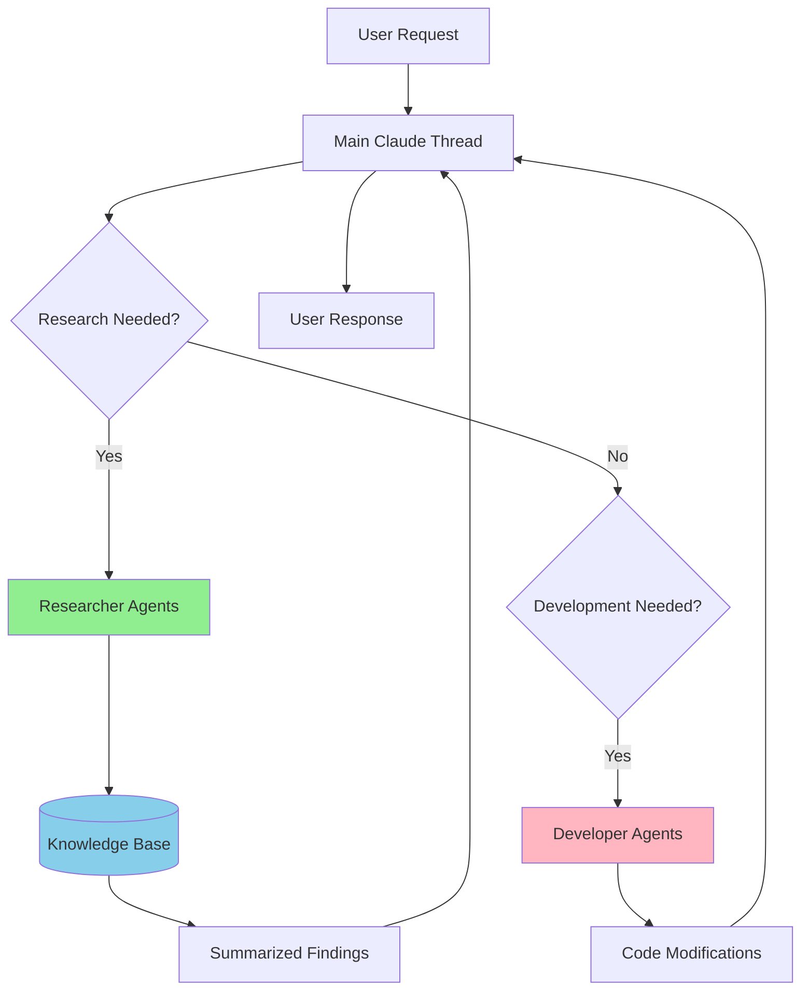

# Agent Transition Analysis: From Developers to Researchers

## 🎯 Executive Summary
Analysis of 28 agents reveals a mixed transition state: 10 agents (36%) successfully converted to research-only, 15 agents (54%) remain as code-modifying developers, and 3 agents (10%) need conversion. The transition strategy is working but requires completion for remaining developer agents.
^summary

## 📊 Current Agent Inventory

### Total Agents: 28

| Category | Count | Percentage |
|----------|-------|------------|
| Researchers (Read/Write only) | 10 | 36% |
| Developers (Edit/MultiEdit) | 15 | 54% |
| Reviewers (Read only) | 1 | 3% |
| Curators | 1 | 3% |
| Duplicates to Remove | 1 | 3% |

## 🔍 Agent Categories by Tool Permissions

### ✅ Successfully Transitioned Researchers (10)
These agents have **no Edit/MultiEdit** tools - they only research and document:

1. **svelte-researcher** - `Read, Write, Grep, Glob, WebFetch`
2. **react-researcher** - `Read, Write, Grep, Glob, WebFetch`
3. **nextjs-researcher** - `Read, Write, Grep, Glob, WebFetch`
4. **ui-ux-researcher** - `Read, Write, Grep, Glob, WebFetch`
5. **data-flow-researcher** - `Read, Write, Grep, Glob, WebFetch`
6. **styling-researcher** - `Read, Write, Grep, Glob, WebFetch`
7. **tailwind-researcher** - `Read, Write, Grep, Glob, WebFetch`
8. **component-library-researcher** - `Read, Write, Grep, Glob, WebFetch`
9. **design-system-researcher** - `Read, Write, Grep, Glob, WebFetch`
10. **knowledge-curator** - `Read, Write, Grep, Glob` (special role)

### ⚠️ Still Active Developers (15)
These agents retain **Edit/MultiEdit** capabilities for code modification:

1. **svelte-developer** - Has Edit, MultiEdit *(duplicate of researcher)*
2. **react-developer** - Has Edit, MultiEdit *(duplicate of researcher)*
3. **nextjs-developer** - Has Edit, MultiEdit *(duplicate of researcher)*
4. **styling-specialist** - Has Edit, MultiEdit *(needs researcher conversion)*
5. **data-flow-architect** - Has Edit, MultiEdit *(has researcher version)*
6. **ui-ux-accessibility** - Has Edit *(has researcher version)*
7. **design-theming-specialist** - Has Edit, MultiEdit *(needs researcher)*
8. **state-persistence-sync** - Has Edit, MultiEdit
9. **deployment-cicd** - Has Edit, MultiEdit, Bash
10. **ios-optimizer** - Has Edit
11. **performance-optimizer** - Has Edit, MultiEdit
12. **testing-qa** - Has Edit, MultiEdit, Bash
13. **firebase-specialist** - Has Edit, MultiEdit, Bash
14. **api-integration** - Has Edit, MultiEdit, Bash
15. **debug-troubleshooter** - Has Edit, MultiEdit, Bash
16. **refactor-specialist** - Has Edit, MultiEdit

### 🔍 Read-Only Reviewer (1)
1. **code-reviewer** - `Read, Grep, Glob, Bash` (review only, no modifications)

## 📈 Transition Progress Analysis

### Conversion Status by Framework
| Framework | Developer | Researcher | Status |
|-----------|-----------|------------|--------|
| Svelte | ✅ svelte-developer | ✅ svelte-researcher | Duplicated |
| React | ✅ react-developer | ✅ react-researcher | Duplicated |
| Next.js | ✅ nextjs-developer | ✅ nextjs-researcher | Duplicated |

### Conversion Status by Domain
| Domain | Developer Version | Researcher Version | Status |
|--------|------------------|-------------------|---------|
| UI/UX | ui-ux-accessibility | ui-ux-researcher | ✅ Converted |
| Data Flow | data-flow-architect | data-flow-researcher | ✅ Converted |
| Styling | styling-specialist | styling-researcher | ✅ Converted |
| Design | design-theming-specialist | design-system-researcher | ✅ Converted |
| Tailwind | - | tailwind-researcher | ✅ New |
| Components | - | component-library-researcher | ✅ New |

## 🎯 Tool Usage Patterns

### Tool Distribution
```
Read: 28/28 (100%) - All agents can read
Grep: 28/28 (100%) - All agents can search
Glob: 27/28 (96%) - Almost all can find files
WebFetch: 20/28 (71%) - Most can fetch documentation

Write: 10/28 (36%) - Researchers only (documentation)
Edit: 15/28 (54%) - Developers only (code modification)
MultiEdit: 14/28 (50%) - Developers only (bulk changes)
Bash: 11/28 (39%) - Developers + reviewer
```

### Key Insight: Clear Separation
- **Researchers**: Read, Write, Grep, Glob, WebFetch (no Edit)
- **Developers**: Read, Edit, MultiEdit, Grep, Glob, Bash
- **Hybrid Risk**: None currently - good separation!

## 💡 Insights and Patterns

### Success Patterns
1. **Clear naming convention**: `-researcher` suffix clearly identifies research agents
2. **Tool restriction works**: Removing Edit/MultiEdit forces research focus
3. **Write tool repurposed**: Now used for documentation, not code
4. **WebFetch critical**: Enables documentation research

### Problem Patterns
1. **Duplicates exist**: Framework agents have both developer and researcher versions
2. **Inconsistent conversion**: Some domains fully converted, others not
3. **Specialized developers needed**: Some agents (deployment, testing) should stay as developers

## 🚀 Recommendations

### Priority 1: Remove Duplicates
These have researcher versions and should be removed or clearly marked:
- [ ] Remove/archive `svelte-developer`
- [ ] Remove/archive `react-developer`
- [ ] Remove/archive `nextjs-developer`

### Priority 2: Keep as Developers (Purposeful)
These should remain code-modifying agents:
- ✅ **deployment-cicd** - Needs to modify CI/CD configs
- ✅ **testing-qa** - Needs to write/modify tests
- ✅ **debug-troubleshooter** - Needs to fix bugs
- ✅ **refactor-specialist** - Needs to refactor code
- ✅ **performance-optimizer** - Needs to optimize code

### Priority 3: Consider Conversion
Evaluate if these need researcher versions:
- [ ] **state-persistence-sync** - Could research patterns instead
- [ ] **firebase-specialist** - Could research Firebase patterns
- [ ] **api-integration** - Could research API patterns
- [ ] **ios-optimizer** - Could research iOS optimization

### Priority 4: Already Converted (Remove Originals)
- [ ] Archive `styling-specialist` (use styling-researcher)
- [ ] Archive `ui-ux-accessibility` (use ui-ux-researcher)
- [ ] Archive `data-flow-architect` (use data-flow-researcher)
- [ ] Archive `design-theming-specialist` (use design-system-researcher)

## 📊 Transition Metrics

### Current State
- **36%** agents fully transitioned to research-only
- **54%** agents still modify code
- **10%** agents in ambiguous state

### Target State
- **60%** research agents (knowledge gathering)
- **35%** developer agents (purposeful code modification)
- **5%** specialized agents (review, curation)

### Transition Progress: 60% Complete

## 🔄 Information Flow Architecture



## 🎯 Action Items

### Immediate Actions
1. [ ] Remove duplicate framework developers
2. [ ] Archive converted specialist agents
3. [ ] Update main thread to prefer researchers

### Future Considerations
1. [ ] Create "agent-selector" to choose right agent
2. [ ] Implement knowledge synthesis agent
3. [ ] Add metrics tracking for agent usage

## 📚 Related Concepts
- [[Agent Architecture]] - Overall agent design
- [[Research Methodology]] - How researchers work
- [[Knowledge Management]] - Knowledge base structure
- [[Code Modification Strategy]] - When to modify vs research

## 🏷️ Tags
#type/research #topic/agents #architecture/transition #status/current #analysis/complete

---
*Research conducted by knowledge-curator on 2024-01-16*