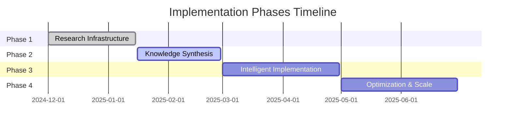

# Implementation Phases: Strategic Roadmap

## Overview
A phased approach to transitioning from traditional code-first development to knowledge-driven, research-first methodology. Each phase builds upon the previous, creating a compounding effect of accumulated knowledge and improved development practices.

## Phase Timeline


## 📘 Phase 1: Research Infrastructure
**Status**: ✅ Complete (90%)  
**Duration**: December 2024 - January 2025

### Objectives
- Establish knowledge management system
- Create researcher agents
- Set up documentation structure
- Define research workflows

### Completed Deliverables
- ✅ Knowledge vault structure (`_knowledge/`)
- ✅ 10 researcher agents configured
- ✅ Obsidian-compatible formatting
- ✅ Wiki-linking system
- ✅ Initial research documents
- ✅ Agent transition analysis

### Remaining Tasks
- [ ] Remove duplicate developer agents
- [ ] Complete agent documentation
- [ ] Set up automated knowledge indexing

### Key Achievements
```yaml
Agents Created: 10 researchers
Knowledge Structure: Established
Documentation: Wiki-linked
Integration: Obsidian-compatible
```

### Lessons Learned
- Clear separation between research and development agents is crucial
- Wiki-linking enables powerful knowledge connections
- Obsidian compatibility provides excellent visualization

## 📚 Phase 2: Knowledge Synthesis
**Status**: 🔄 Active (25%)  
**Duration**: January 2025 - February 2025

### Objectives
- Build comprehensive knowledge base
- Create pattern libraries
- Establish best practices documentation
- Develop ADR process

### Current Focus Areas

#### Week 1-2: Foundation Knowledge
- [ ] Document core framework patterns (React, Svelte, Next.js)
- [ ] Create component architecture guides
- [ ] Build state management patterns library
- [ ] Document routing strategies

#### Week 3-4: Architecture Patterns
- [ ] Create microservices patterns
- [ ] Document API design patterns
- [ ] Build data flow architectures
- [ ] Create scalability patterns

#### Week 5-6: Best Practices
- [ ] Security best practices
- [ ] Performance optimization patterns
- [ ] Testing strategies
- [ ] CI/CD patterns

#### Week 7-8: Synthesis & Organization
- [ ] Create pattern selection matrix
- [ ] Build decision trees for architecture choices
- [ ] Develop quick reference guides
- [ ] Create knowledge maps

### Deliverables
- Pattern Library (30+ patterns)
- Best Practices Guide
- ADR Template and Process
- Quick Reference Cards
- Architecture Decision Trees

### Success Metrics
```yaml
Patterns Documented: Target 30+
ADRs Created: Target 10+
Knowledge Articles: Target 50+
Cross-references: Target 200+
```

### Knowledge Structure Expansion
```
_knowledge/
├── 01-Research/
│   ├── Framework-Patterns/
│   ├── Architecture-Patterns/
│   └── Best-Practices/
├── 02-Architecture/
│   ├── Pattern-Library/
│   ├── Decision-Trees/
│   └── Reference-Architectures/
└── 04-Decisions/
    └── ADRs/
```

## 🚀 Phase 3: Intelligent Implementation
**Status**: 📅 Planned  
**Duration**: March 2025 - April 2025

### Objectives
- Apply accumulated knowledge to real projects
- Measure improvement metrics
- Refine research-first workflow
- Build reusable components

### Planned Activities

#### Month 1: Application
- Apply patterns to new features
- Use ADR process for decisions
- Implement with research backing
- Track metrics and improvements

#### Month 2: Refinement
- Analyze implementation outcomes
- Refine patterns based on usage
- Optimize research workflow
- Build component library

### Expected Deliverables
- Component Library (20+ components)
- Implementation Playbooks
- Workflow Optimization Guide
- Metrics Dashboard
- Case Studies (5+)

### Success Metrics
```yaml
Development Speed: +30% after research
Rework Reduction: -50%
Pattern Reuse: 70% of implementations
First-time Success: 85% of features
```

### Implementation Strategy
1. **Select pilot projects** for pattern application
2. **Measure baseline** metrics before implementation
3. **Apply patterns** with full research backing
4. **Track outcomes** and improvements
5. **Document learnings** and refine patterns

## 🔧 Phase 4: Optimization & Scale
**Status**: 🔮 Future  
**Duration**: May 2025 - June 2025

### Objectives
- Optimize knowledge retrieval
- Automate pattern application
- Scale across teams
- Create self-improving system

### Planned Features

#### Knowledge Automation
- Automated pattern recognition
- AI-assisted architecture selection
- Smart knowledge retrieval
- Contextual recommendation engine

#### Scaling Strategy
- Team onboarding playbooks
- Knowledge sharing protocols
- Cross-project pattern sharing
- Collaborative research workflows

### Expected Outcomes
```yaml
Knowledge Retrieval: <30 seconds
Pattern Application: 90% automated
Team Adoption: 100%
Knowledge Growth: 20% monthly
```

## 🎯 Cross-Phase Dependencies

### Knowledge Flow
```
Phase 1 → Infrastructure enables documentation
Phase 2 → Documentation enables patterns
Phase 3 → Patterns enable intelligent implementation
Phase 4 → Implementation feeds back to knowledge
```

### Critical Path Items
1. **Agent System** (Phase 1) → Required for research
2. **Pattern Library** (Phase 2) → Required for implementation
3. **ADR Process** (Phase 2) → Required for decisions
4. **Metrics System** (Phase 3) → Required for optimization

## 📊 Phase Transition Criteria

### Phase 1 → Phase 2
- ✅ All researcher agents operational
- ✅ Knowledge vault structured
- ✅ Documentation system working
- [ ] Initial research completed

### Phase 2 → Phase 3
- [ ] 30+ patterns documented
- [ ] ADR process established
- [ ] Best practices guide complete
- [ ] Knowledge maps created

### Phase 3 → Phase 4
- [ ] Component library built
- [ ] Metrics show improvement
- [ ] Workflows optimized
- [ ] Case studies documented

## 🚦 Risk Management

### Phase 2 Risks
| Risk | Impact | Mitigation |
|------|--------|------------|
| Knowledge overload | High | Organize with clear hierarchy |
| Pattern paralysis | Medium | Focus on most-used patterns |
| Documentation debt | Medium | Dedicate time weekly |

### Phase 3 Risks
| Risk | Impact | Mitigation |
|------|--------|------------|
| Resistance to change | High | Show metrics improvements |
| Pattern misapplication | Medium | Create clear guidelines |
| Slow initial development | Low | Emphasize long-term gains |

## 💡 Quick Wins Strategy

### Immediate Wins (This Week)
- Create first 5 patterns
- Document one complete workflow
- Build pattern template
- Create first ADR

### Short-term Wins (This Month)
- Complete framework patterns
- Build quick reference guide
- Create decision tree
- Document 10 best practices

### Medium-term Wins (This Quarter)
- Full pattern library
- Complete knowledge base
- Measurable improvements
- Team adoption

## 📈 Success Tracking

### Weekly Metrics
- Patterns documented
- Knowledge articles created
- Cross-references added
- Agent usage frequency

### Monthly Metrics
- Development velocity
- Rework frequency
- Pattern reuse rate
- Knowledge base growth

### Quarterly Metrics
- Time-to-implementation
- Technical debt reduction
- Team satisfaction
- Knowledge ROI

## 🔗 Related Documents
- [[Research-First-Methodology]] - Core methodology
- [[Pattern-Library]] (To be created)
- [[ADR-Template]] (To be created)
- [[Metrics-Dashboard]] (To be created)
- [[Knowledge-Maps]] (To be created)

---

*Roadmap Version: 1.0*  
*Last Updated: 2025-01-16*  
*Next Review: 2025-01-23*  
*Phase Reviews: End of each phase*