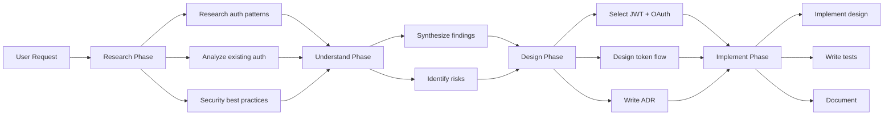

# Research-First Development Methodology

## Overview
A systematic approach to software development that prioritizes knowledge gathering and synthesis before code implementation. This methodology transforms reactive coding into proactive, informed decision-making.

## Core Principle
**"Never write code you don't fully understand the context for."**

## The Four Phases

### 🔍 Phase 1: Research
**Goal**: Gather comprehensive knowledge about the problem space

#### Activities
- Deploy researcher agents to investigate:
  - Existing codebase patterns
  - Framework documentation
  - Best practices and anti-patterns
  - Similar implementations
  - Performance considerations
  - Security implications

#### Outputs
- Research documents in `_knowledge/01-Research/`
- Pattern identification notes
- Technology evaluation summaries
- Dependency analysis

#### Tools & Agents
- `general-researcher` - Broad investigation
- `*-researcher` agents - Framework-specific research
- `codebase-analyst` - Existing code analysis

### 🧠 Phase 2: Understand
**Goal**: Synthesize research into actionable insights

#### Activities
- Analyze research findings
- Identify applicable patterns
- Map dependencies and relationships
- Evaluate trade-offs
- Consider edge cases
- Review similar solutions

#### Outputs
- Architectural diagrams
- Pattern applicability matrix
- Risk assessment
- Technical requirements document

#### Tools & Agents
- `knowledge-synthesizer` - Combine findings
- `knowledge-curator` - Organize insights

### 📐 Phase 3: Design
**Goal**: Create implementation blueprint based on understanding

#### Activities
- Select appropriate patterns
- Design component architecture
- Plan data flow
- Define interfaces
- Create implementation checklist
- Write ADRs for significant decisions

#### Outputs
- Design documents in `_knowledge/02-Architecture/`
- ADRs in `_knowledge/04-Decisions/`
- Implementation plan
- Test strategy

#### Documentation Structure
```
_knowledge/
├── 02-Architecture/
│   ├── [Feature]-Design.md
│   └── [Component]-Architecture.md
└── 04-Decisions/
    └── ADR-[Number]-[Decision].md
```

### 🛠️ Phase 4: Implement
**Goal**: Execute design with confidence and precision

#### Activities
- Follow implementation plan
- Apply identified patterns
- Reuse proven solutions
- Write tests based on research
- Document deviations
- Update knowledge base with learnings

#### Outputs
- Clean, well-architected code
- Comprehensive tests
- Updated documentation
- Performance metrics

#### Tools & Agents
- Targeted developer agents only when needed
- Focus on quality over speed

## Workflow Examples

### Example 1: Adding Authentication


### Example 2: Performance Optimization
1. **Research**: Analyze current performance, research optimization patterns
2. **Understand**: Identify bottlenecks, understand trade-offs
3. **Design**: Select optimization strategies, plan implementation
4. **Implement**: Apply optimizations, measure improvements

## Benefits

### Immediate Benefits
- **Reduced rework**: Get it right the first time
- **Better decisions**: Based on comprehensive knowledge
- **Consistent patterns**: Reuse proven solutions
- **Clear documentation**: Research becomes documentation

### Long-term Benefits
- **Knowledge accumulation**: Every project adds to knowledge base
- **Pattern library**: Reusable solutions grow over time
- **Faster development**: After initial research investment
- **Higher quality**: Informed decisions reduce technical debt

## Anti-Patterns to Avoid

### ❌ Code-First Thinking
- Jumping directly to implementation
- "Let's just try it and see"
- Ignoring existing patterns

### ❌ Research Paralysis
- Endless research without synthesis
- Over-analyzing simple problems
- Not transitioning to implementation

### ❌ Context Ignorance
- Not researching existing codebase
- Ignoring project conventions
- Missing architectural constraints

## When to Apply This Methodology

### ✅ Always Apply For
- New feature implementation
- Architectural changes
- Performance optimization
- Security implementations
- Complex integrations

### ⚡ Fast-Track For
- Bug fixes (still research root cause)
- Simple UI changes
- Configuration updates
- Documentation updates

## Success Metrics

### Research Phase Metrics
- Coverage: Did we research all aspects?
- Depth: Is research comprehensive?
- Relevance: Is research applicable?

### Implementation Metrics
- First-time success rate
- Rework frequency
- Pattern reuse rate
- Technical debt accumulation

## Integration with Agent System

### Agent Deployment Strategy
```
1. Main Thread receives request
2. Analyze complexity and domain
3. Deploy appropriate researchers:
   - general-researcher for broad investigation
   - Specific researchers for frameworks
   - codebase-analyst for existing code
4. knowledge-synthesizer combines findings
5. Main Thread designs solution
6. Deploy minimal developers if needed
```

### Knowledge Flow
```
Researchers → Knowledge Base → Synthesis → Design → Implementation
     ↑                                                    ↓
     └────────────── Continuous Learning ←───────────────┘
```

## Templates and Tools

### Research Document Template
```markdown
# Research: [Topic]
## Question/Problem
## Findings
### Option 1
### Option 2
## Recommendations
## References
```

### ADR Template
```markdown
# ADR-[Number]: [Decision]
## Status: [Proposed|Accepted|Deprecated]
## Context
## Decision
## Consequences
```

## Continuous Improvement

### Weekly Reviews
- What research proved most valuable?
- What patterns emerged?
- What knowledge gaps exist?

### Knowledge Base Maintenance
- Update outdated research
- Consolidate duplicate findings
- Extract patterns for reuse
- Create knowledge maps

## Related Documents
- [[Knowledge Management Strategy]]
- [[Agent System Architecture]]
- [[Pattern Library]] (To be created)
- [[ADR Process]] (To be created)

---

*Methodology Version: 1.0*  
*Last Updated: 2025-01-16*  
*Next Review: 2025-01-30*