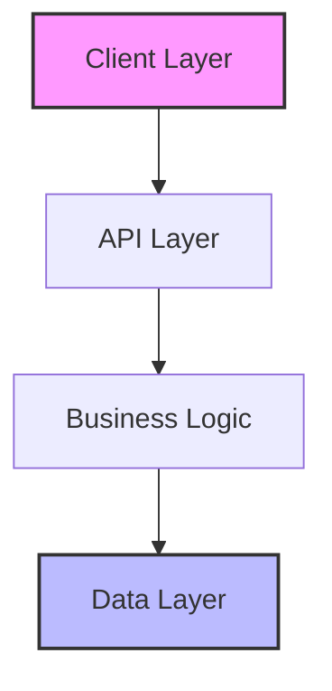

# Implementation Plan: {{Project Name}}

## 📋 Executive Summary
<!-- Brief overview of the implementation approach -->
Based on research in [[research-summary]], this plan outlines a [timeframe] implementation of [project name] using [key technologies]. The approach prioritizes [key priorities] while managing risks through [mitigation strategy].

## 🏗️ Architecture Overview

### System Architecture


### Technology Stack
Based on research in [[tech-stack-research]]:

| Layer | Technology | Justification | Reference |
|-------|------------|---------------|-----------|
| Frontend | {{framework}} | {{reason}} | [[research-doc]] |
| Backend | {{framework}} | {{reason}} | [[research-doc]] |
| Database | {{database}} | {{reason}} | [[research-doc]] |
| Hosting | {{platform}} | {{reason}} | [[research-doc]] |

### Key Architectural Decisions
- [[ADR-001]]: {{Decision title}}
- [[ADR-002]]: {{Decision title}}
- [[ADR-003]]: {{Decision title}}

## 📦 Component Breakdown

### Core Components
```
src/
├── components/
│   ├── {{Component1}}/     # {{Purpose}}
│   ├── {{Component2}}/     # {{Purpose}}
│   └── {{Component3}}/     # {{Purpose}}
├── services/
│   ├── {{Service1}}/       # {{Purpose}}
│   └── {{Service2}}/       # {{Purpose}}
└── utils/
    └── {{Utility}}/        # {{Purpose}}
```

### Component Responsibilities
| Component | Purpose | Dependencies | Priority |
|-----------|---------|--------------|----------|
| {{name}} | {{what it does}} | {{what it needs}} | P0 |
| {{name}} | {{what it does}} | {{what it needs}} | P1 |

## 🔄 Data Flow Design

### State Management
Based on [[state-management-research]]:
- **Approach**: {{Redux/Context/Zustand/etc}}
- **Justification**: {{Why this approach}}
- **Data Flow Pattern**: {{Unidirectional/Bidirectional}}

### Data Models
```typescript
// Core data structures
interface {{ModelName}} {
  id: string;
  // ... properties
}
```

### API Design
Based on [[api-patterns-research]]:
- **Style**: {{REST/GraphQL/RPC}}
- **Authentication**: {{Method}}
- **Key Endpoints**:
  - `GET /api/{{resource}}` - {{purpose}}
  - `POST /api/{{resource}}` - {{purpose}}

## 📅 Implementation Phases

### Phase 1: Foundation ({{Duration}})
**Goal**: Establish core infrastructure and development environment

#### Tasks
- [ ] Project setup and configuration
- [ ] Development environment setup
- [ ] CI/CD pipeline configuration
- [ ] Basic project structure
- [ ] Authentication system

#### Deliverables
- Working development environment
- Basic authentication flow
- Deployment pipeline

#### Success Criteria
- [ ] Local development running
- [ ] Tests passing
- [ ] Successful deployment to staging

### Phase 2: Core Features ({{Duration}})
**Goal**: Implement primary functionality

#### Tasks
- [ ] {{Core feature 1}}
- [ ] {{Core feature 2}}
- [ ] {{Core feature 3}}
- [ ] Basic error handling
- [ ] Initial testing

#### Deliverables
- Core feature implementation
- Unit test coverage >60%
- API documentation

#### Success Criteria
- [ ] All core features functional
- [ ] Tests passing
- [ ] No critical bugs

### Phase 3: Enhancement ({{Duration}})
**Goal**: Polish and optimize

#### Tasks
- [ ] UI/UX improvements
- [ ] Performance optimization
- [ ] Enhanced error handling
- [ ] Comprehensive testing
- [ ] Documentation

#### Deliverables
- Polished user interface
- Performance metrics met
- Complete documentation

#### Success Criteria
- [ ] Performance targets met
- [ ] Test coverage >80%
- [ ] Documentation complete

### Phase 4: Launch Preparation ({{Duration}})
**Goal**: Prepare for production

#### Tasks
- [ ] Security audit
- [ ] Load testing
- [ ] Monitoring setup
- [ ] Backup procedures
- [ ] Launch plan

#### Deliverables
- Production-ready system
- Monitoring dashboard
- Runbook documentation

## ⚠️ Risk Assessment & Mitigation

### Technical Risks
| Risk | Impact | Probability | Mitigation | Reference |
|------|--------|-------------|------------|-----------|
| {{risk description}} | High | Medium | {{mitigation strategy}} | [[research-doc]] |
| {{risk description}} | Medium | Low | {{mitigation strategy}} | [[research-doc]] |

### Dependencies
| Dependency | Risk | Mitigation |
|------------|------|------------|
| {{external service}} | {{what could go wrong}} | {{backup plan}} |
| {{library/framework}} | {{what could go wrong}} | {{backup plan}} |

## 📊 Estimation & Resources

### Time Estimates
| Phase | Duration | Resources | Dependencies |
|-------|----------|-----------|--------------|
| Phase 1 | {{days}} | {{people}} | None |
| Phase 2 | {{days}} | {{people}} | Phase 1 |
| Phase 3 | {{days}} | {{people}} | Phase 2 |
| Phase 4 | {{days}} | {{people}} | Phase 3 |

**Total Duration**: {{total days/weeks}}

### Resource Allocation
- **Developer 1**: {{responsibilities}}
- **Developer 2**: {{responsibilities}}
- **Additional Resources**: {{if needed}}

## ✅ Definition of Done

### Feature Complete
- [ ] All acceptance criteria met
- [ ] Code reviewed and approved
- [ ] Tests written and passing
- [ ] Documentation updated
- [ ] Deployed to staging

### Release Ready
- [ ] All features complete
- [ ] Performance targets met
- [ ] Security review passed
- [ ] Monitoring in place
- [ ] Rollback plan ready

## 🔄 Implementation Patterns

### Development Workflow
Based on [[development-practices-research]]:
1. Feature branch from main
2. Implement with TDD
3. Code review required
4. CI/CD validation
5. Deploy to staging
6. QA validation
7. Merge to main

### Code Standards
- **Style Guide**: [[coding-standards]]
- **Testing Strategy**: [[testing-approach]]
- **Documentation**: [[documentation-standards]]

## 📈 Success Metrics

### Technical Metrics
- **Performance**: Page load <2s
- **Availability**: 99.9% uptime
- **Test Coverage**: >80%
- **Bundle Size**: <200KB

### Business Metrics
- **User Adoption**: {{target}}
- **Task Completion**: {{target}}
- **User Satisfaction**: {{target}}

## 🔗 References

### Research Documents
- [[research-summary]] - Synthesized findings
- [[architecture-research]] - Architecture patterns
- [[technology-evaluation]] - Tech stack analysis
- [[risk-analysis]] - Risk assessment

### Related Plans
- [[testing-plan]] - Detailed testing strategy
- [[deployment-plan]] - Deployment procedures
- [[monitoring-plan]] - Monitoring setup

## 📝 Notes & Assumptions
- {{Key assumption 1}}
- {{Key assumption 2}}
- {{Important note}}

---
## Plan Approval

- [ ] Technical Review
- [ ] Resource Review  
- [ ] Timeline Review
- [ ] Risk Review
- [ ] **Final Approval**

*Once approved, this plan guides all implementation work. Updates require review.*